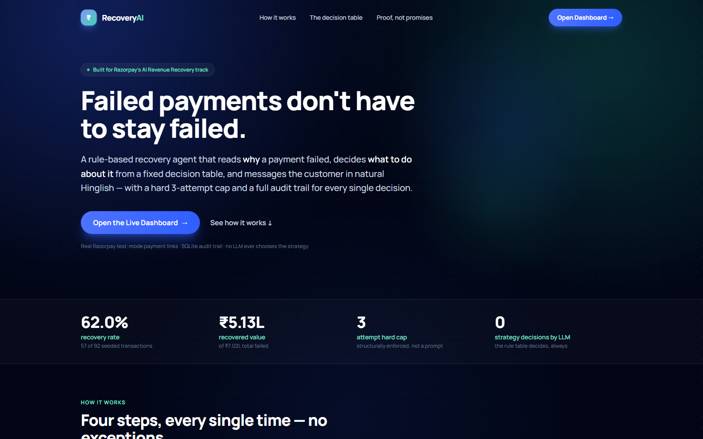
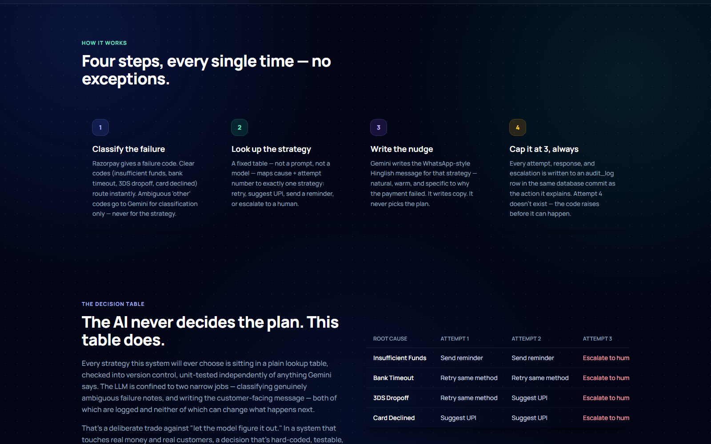
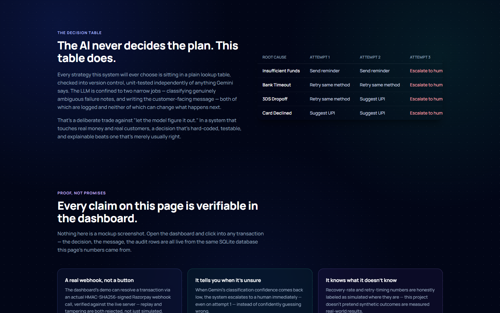
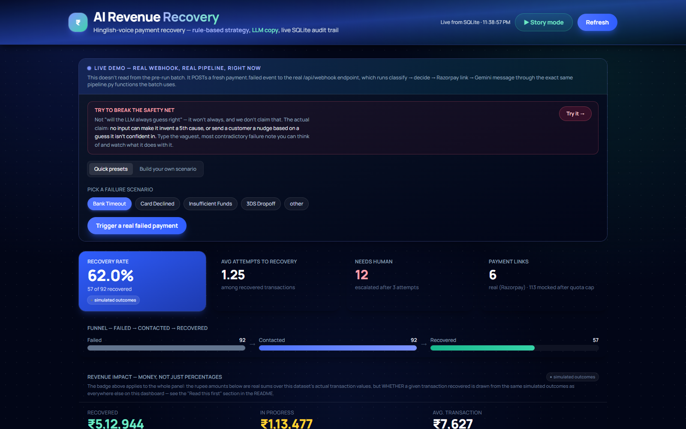
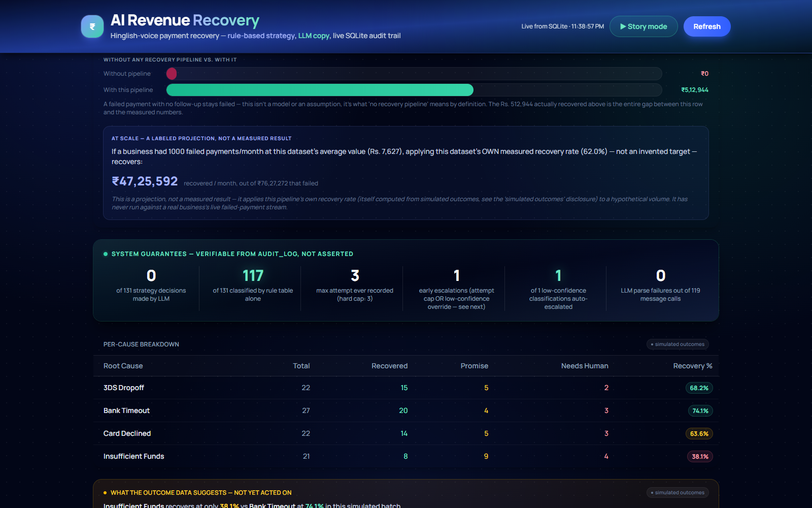
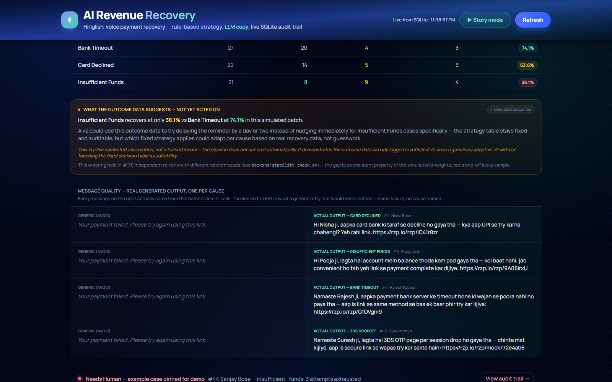
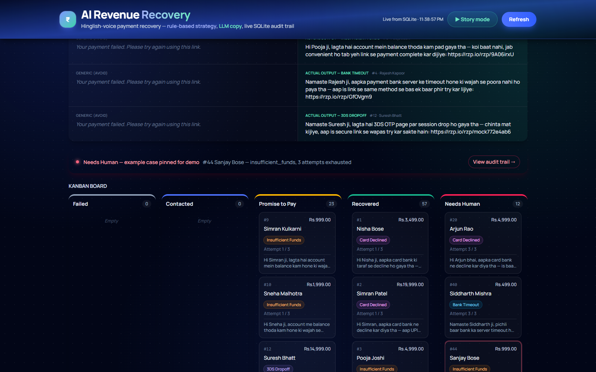
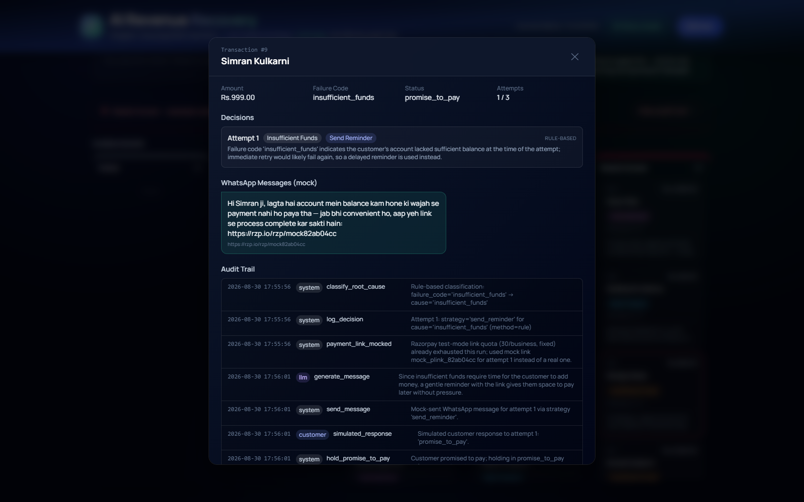
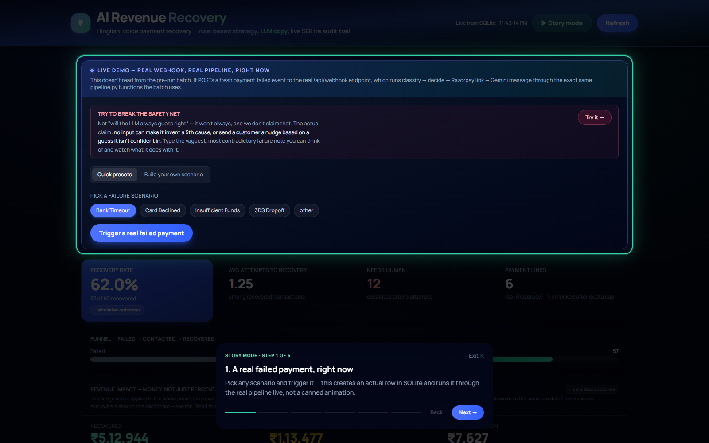

# AI Revenue Recovery — Hinglish-Voice Payment Recovery Agent

**Live: [payment-recovery-ai.onrender.com](https://payment-recovery-ai.onrender.com)** — a
free-tier instance, so the first request after a period of inactivity can take up to ~50s to
wake up. See "Deploying it" below for what's actually running there.

A payment-failure recovery pipeline built for Razorpay's "AI Revenue Recovery" hackathon
track. It classifies why a payment failed, picks a recovery strategy from a **fixed,
non-negotiable decision table** (never invented by an LLM), writes a natural Hinglish
WhatsApp-style nudge that names the actual failure reason, creates a real Razorpay
test-mode Payment Link, and logs every step to an auditable SQLite trail.

The design brief was explicit: **correctness, auditability, and honest metrics over a
flashier demo.** Everything below — including the parts that didn't go smoothly — is
reported the way it actually happened.

---

## Screenshots

All captured from the live deployed instance linked above, not localhost — this is what
the site actually looks like right now, not a mockup.

**Landing page — the pitch, the real proof-stat strip, and the decision table:**





**Dashboard — live metrics, the Live Demo panel, and the 'try to break it' challenge:**


**Revenue Impact and System Guarantees — the numbers behind the claims:**




**Message quality and the Kanban board:**




**A transaction's full decision + audit trail, and the guided Story Mode walkthrough:**




---

## Read this first: what's real, what's simulated, and why

Three things a reviewer should know before looking at any number below, stated plainly
instead of left to be discovered mid-review:

1. **113 of 119 payment links (≈95%) in `recovery.db` are disclosed mocks, not real
   Razorpay links.** Razorpay's test-mode API caps a business at 30 Payment Links,
   non-resetting. That cap was hit partway through the batch, documented in full below —
   6 links are genuinely real, verifiable in the Razorpay test dashboard, and prove the
   integration works end-to-end. A second, smaller batch (`recovery_real.db`) exists
   specifically to show 100% real links with zero mocking — see below.
2. **Every recovery-rate number on this dashboard (62.6%, the per-cause breakdown, the
   "Adaptive Insight" panel) is computed from *simulated* customer responses, not
   measured real-world behavior.** `pipeline.py`'s `_OUTCOME_WEIGHTS` are hand-picked
   probabilities (e.g. "a bank-timeout retry succeeds 55% of the time"), not something
   discovered from real customers. The classify → decide → message → link pipeline is
   100% real; whether a given simulated customer "pays" afterward is a weighted coin
   flip. The dashboard now marks every recovery-rate figure with a **"simulated
   outcomes"** badge so this is visible at the point of display, not just here.
3. **The gap between causes (e.g. insufficient_funds recovering worse than
   bank_timeout) is a real, stable property of the simulation weights, not a lucky
   single run.** `backend/stability_check.py` re-runs the outcome simulation across 30
   independent random seeds; the ordering (insufficient_funds < bank_timeout) held in
   all 30. That doesn't make the *absolute* numbers (38.1%, 76.9%) real-world facts — it
   means the *relative pattern* the dashboard highlights isn't sampling noise.
4. **The live deployment's transaction count will not exactly match the "92" cited
   throughout this README.** Every visitor to the live URL who submits the Live Demo
   form adds a real, permanent row to that instance's database — this was true and
   disclosed for local Refresh-button usage before, and now applies to anyone with the
   link, not just the author. The 92-transaction numbers below describe the *committed*
   `recovery.db` in this repo, reproducible by running the project locally without
   clicking anything write-triggering; the live site's numbers are expected to drift
   upward from there and are correct to do so.

None of this is a late-discovered flaw — it's a direct consequence of building a batch
demo without a live payments business generating real failure/recovery data, which no
hackathon submission in this position actually has. The rest of this README is written
assuming a reader has already seen this section.

---

## What this is not

- Not a generic "your payment failed, please retry" bot.
- Not an LLM that decides what to do. The LLM only **explains** an already-chosen
  strategy and **writes the copy** for it — never picks the strategy itself.
- Not a cherry-picked demo subset. All metrics below are computed live from the full
  90-transaction batch, recomputed on every dashboard load, including the failure case.

---

## Architecture

```
┌─────────────┐      ┌──────────────────┐      ┌─────────────────────┐
│  seed.py     │─────▶│  recovery.db      │◀────▶│  pipeline.py         │
│  (synthetic  │      │  (SQLite,         │      │  (batch orchestrator)│
│  batch)      │      │   schema.sql)     │      └──────────┬───────────┘
└─────────────┘      └──────────────────┘                 │
                              ▲                             │ per transaction, per attempt (max 3)
                              │                             ▼
                     ┌────────┴─────────┐         ┌──────────────────────┐
                     │  api.py          │         │  classifier.py         │
                     │  (read-only      │         │  rule-based cause →    │
                     │  Flask API,      │         │  fixed strategy table  │
                     │  live queries)   │         │  (pure functions)      │
                     └────────┬─────────┘         └──────────┬─────────────┘
                              │                                │ only if AMBIGUOUS
                              ▼                                ▼
                     ┌──────────────────┐         ┌──────────────────────┐
                     │  React dashboard  │         │  gemini_client.py      │
                     │  (kanban + funnel │         │  1) classify ambiguous │
                     │  + audit trail)   │         │  2) write Hinglish msg │
                     └──────────────────┘         └──────────┬─────────────┘
                                                                │
                                                                ▼
                                                     ┌──────────────────────┐
                                                     │  razorpay_client.py    │
                                                     │  real test-mode        │
                                                     │  Payment Links          │
                                                     │  (+ disclosed mock       │
                                                     │  fallback, see below)   │
                                                     └──────────────────────┘

Every arrow above that represents a side effect also writes a row to `audit_log`,
in the same SQLite commit — no side effect happens without an audit row.
```

**Stack:** Python 3.14 (backend + pipeline), Flask (read-only API), SQLite (single-file
audit log), Gemini API (`gemini-3.5-flash-lite`), Razorpay Test Mode API, React + Vite +
Tailwind v4 (dashboard).

---

## The decision table (fixed, never LLM-generated)

| `razorpay_failure_code` | `root_cause`         | `strategy_chosen`   |
|--------------------------|-----------------------|----------------------|
| `insufficient_funds`     | `insufficient_funds`  | `send_reminder`      |
| `bank_timeout`            | `bank_timeout`         | `retry_same_method`  |
| `3ds_dropoff`             | `3ds_dropoff`          | `retry_same_method`  |
| `card_declined`           | `card_declined`        | `suggest_upi`        |
| `other` / unrecognized    | *(ambiguous → LLM classifies into one of the 4 causes above, never a 5th label)* | |
| *any cause, attempt 3*    | *(unchanged)*          | `escalate_human` (forced, overrides the table above) |

This table lives in [`backend/classifier.py`](backend/classifier.py) as plain Python
functions (`classify_cause`, `strategy_for_cause`, `decide`) — no prompt involved. Gemini
is called from two narrow, independently-testable functions in
[`backend/gemini_client.py`](backend/gemini_client.py):

1. `classify_ambiguous_cause(...)` — **only** for `failure_code="other"`. Strict JSON
   output, constrained to the same 4 labels, retries once on invalid output, then raises
   (caller falls back to a deterministic default and logs it).
2. `generate_hinglish_message(...)` — runs for every attempt, on an **already-decided**
   strategy. Writes the WhatsApp-tone Hinglish nudge + a one-sentence audit reasoning
   string. Same retry-then-fallback contract.

---

## The 3-attempt hard cap

Enforced structurally in `classifier.decide()`: calling it with `attempt_number > 3`
raises `ValueError` — it is not possible for any code path to request a 4th attempt.
On `attempt_number == 3`, the strategy is unconditionally overridden to
`escalate_human` regardless of cause, and no payment link or message is generated for
that attempt (there's no point nudging a customer you're escalating away from).

---

## Live demo mode — not just a batch report

Everything above runs as a batch script against seeded data. To prove this is actual
event-driven logic and not a one-off report generator, the dashboard also has a **Live
Demo** panel that triggers the real pipeline on a brand-new transaction, live, in the
browser:

1. Pick a failure scenario and click "Trigger a real failed payment." This POSTs to
   `/api/webhook/payment-failed` — shaped like a real Razorpay `payment.failed` webhook
   — which creates a new transaction row and runs attempt 1 through the *exact same*
   `pipeline.process_one_attempt()` function the batch runs use: real rule/LLM
   classification, a real Razorpay test-mode Payment Link, a real Gemini-generated
   Hinglish message. Nothing here is pre-computed or read from `recovery.db`.
2. Click "Customer ignored" / "Promise to pay" / "Customer paid" to simulate what
   happens next. This calls `/api/transactions/<id>/respond`, which runs
   `pipeline.record_customer_response()` — the same function the batch pipeline calls.
   If ignored and attempts remain, the next attempt starts automatically and you watch a
   second real decision, link, and message appear live.
3. The whole thing is subject to the identical hard 3-attempt cap and fixed decision
   table as every other transaction — click "Customer ignored" three times on the same
   demo transaction and it escalates to `needs_human` for real, in front of you.

There is no separate "demo mode" code path — `api.py`'s two write endpoints
(`/api/webhook/payment-failed`, `/api/transactions/<id>/respond`) are thin wrappers
around the same `process_one_attempt` / `record_customer_response` functions
`pipeline.py`'s batch loop calls internally. A transaction created this way lives in the
same `transactions` table, gets the same audit trail, and shows up in the same kanban
board as everything else.

### Live traffic simulation on Refresh

The dashboard's **Refresh** button doesn't just re-read `recovery.db` — it first fires
2-3 *real* transactions through the exact same webhook + response pipeline described
above (`frontend/src/simulateActivity.js`), using randomized synthetic customers and
scenarios, then reloads. This is intentional: it makes the dashboard feel like a system
with ongoing traffic instead of a static report, and it is not faked — every one of
those transactions is a real classify → decide → Gemini message → Razorpay-or-mocked
link → simulated customer response, written to the same audit trail as everything else.

**Consequence, stated plainly**: the transaction count is not frozen at 91 — it grows by
2-3 every time Refresh is clicked. The "Honest results" table below reflects the state
*as originally documented*; the live dashboard will show a higher, still-honestly-computed
total the moment anyone clicks Refresh. If you want to reproduce the exact documented
numbers, don't click Refresh — the API returns the current live state on page load
without it, and the numbers below match that initial state.

### A real Razorpay webhook, not another button click

Everything above — including the Live Demo's "Customer paid" response — is either
simulated or presenter-triggered. `POST /api/webhook/razorpay` (`backend/api.py`,
`backend/razorpay_webhook.py`) closes that gap with a genuinely different mechanism: a
real Razorpay webhook receiver with actual HMAC-SHA256 signature verification, exactly
matching [Razorpay's documented scheme](https://razorpay.com/docs/webhooks/validate-test/)
— the `X-Razorpay-Signature` header must be the correct HMAC-SHA256 hex digest of the raw
request body, keyed with the shared webhook secret. This is checked with
`hmac.compare_digest` (constant-time, not `==`) against a secret only Razorpay (or someone
holding it) has.

**What this proves, concretely**: subscribe this endpoint to `payment_link.paid` in the
Razorpay dashboard for any of the 6 real Payment Links this pipeline creates, and when
that link is actually paid, Razorpay calls this endpoint with a payload only it could
have signed correctly. The handler parses the link's `reference_id` back to the exact
transaction/attempt that created it, and calls the *same*
`pipeline.record_customer_response()` the Live Demo button calls — but with
`verified_real=True`, which changes the audit_log action from `simulated_response` to
`verified_real_response` specifically so a reviewer can tell, from the audit trail alone,
which transactions were resolved by a real payment vs. a demo click. The dashboard shows
this as a `✓ Real webhook confirmed` badge on the transaction detail modal.

**Why this isn't demonstrated live end-to-end in the video**: doing so requires this
machine to be reachable from the public internet (a tunnel like ngrok, plus configuring
the tunnel's URL in the Razorpay dashboard) for the duration of judging — a fragile
external dependency that could silently die mid-demo. Rather than risk that, the endpoint
was verified with a full test suite that constructs the exact payload shape and signature
Razorpay's own docs specify and fires it at the real running server — not a mock of the
verification logic, the actual `hmac`-based check, exercised end-to-end:

- ✅ Valid signature + real `payment_link.paid` payload → transaction correctly marked
  `recovered`, audit trail shows `razorpay_webhook_verified` then `verified_real_response`
- ✅ The same event replayed with the same `x-razorpay-event-id` → correctly idempotent
  (`already_processed`, not double-recorded) — Razorpay retries webhook deliveries, so
  this matters for correctness, not just neatness
- ✅ Tampered payload (one field changed) reusing a valid signature from before the
  tamper → **rejected with 401**, not silently accepted
- ✅ No `X-Razorpay-Signature` header at all → **rejected with 401**
- ✅ A garbage/random signature → **rejected with 401**

Every delivery attempt — accepted or rejected — is logged to the `webhook_deliveries`
table (`event_id`, `event_type`, `signature_valid`, raw payload), so even a rejected
forgery attempt is auditable, not silently dropped.

---

## Running it

### 1. Backend setup

```bash
cd backend
py -3 -m pip install -r requirements.txt
```

Create `backend/.env` (gitignored):

```
GEMINI_API_KEY=<your Gemini API key>
GEMINI_MODEL=gemini-3.5-flash-lite
RAZORPAY_KEY_ID=<your Razorpay test key id>
RAZORPAY_KEY_SECRET=<your Razorpay test key secret>
RAZORPAY_WEBHOOK_SECRET=<webhook secret, only needed for /api/webhook/razorpay — see below>
```

### 2. Seed the batch

```bash
py -3 seed.py --count 90
```

Generates ~90 synthetic failed transactions, roughly even across the 4 failure codes
plus a handful of `other` (with free-text gateway notes) to exercise the LLM
classification path.

### 3. Run the classifier unit tests (optional but recommended)

```bash
py -3 -m unittest test_classifier -v
```

### 4. Run the full pipeline

```bash
py -3 pipeline.py --db recovery.db
```

Processes every `status='failed'` transaction through classify → decide → message →
payment link → mock-send → simulate response → retry/escalate, writing the full audit
trail. Re-running against the same DB safely resumes — it only picks up transactions
still in `failed` status.

### 5. Start the API + dashboard

```bash
# terminal 1
cd backend
py -3 api.py --db recovery.db --port 5001

# terminal 2
cd frontend
npm install
npm run dev
```

Open the printed `localhost` URL (default `http://localhost:5173`). The dashboard shows,
top to bottom: live recovery metrics, a funnel, a "System Guarantees" panel (structural
claims like "0 of 129 strategy decisions made by LLM," computed live), a per-cause
breakdown table, a Hinglish message quality showcase (real output vs. a generic baseline),
a pinned `needs_human` example, and the full 5-column kanban board — click any card for
its complete decision + message + audit trail.

To view the 100%-real-links batch instead, point the API at the other DB:

```bash
py -3 api.py --db recovery_real.db --port 5001
```

---

## Deploying it (so it's not only reachable from this laptop)

`render.yaml` at the repo root deploys this as a single Render Web Service — one
`gunicorn`-served Flask process that serves both the JSON API and the built React
frontend from the same origin, so there's no separate frontend host and no cross-origin
config to get wrong.

1. Push this repo to GitHub, then in the Render dashboard: **New → Blueprint**, point it
   at the repo. Render reads `render.yaml` and creates the service automatically.
2. Set the four secret env vars Render will prompt for (`GEMINI_API_KEY`,
   `RAZORPAY_KEY_ID`, `RAZORPAY_KEY_SECRET`, `RAZORPAY_WEBHOOK_SECRET`) — same values as
   `backend/.env` locally. `GEMINI_MODEL` is already set in `render.yaml`.
3. Deploy. The build step runs `npm run build` (frontend) then installs backend
   dependencies; the start command is
   `gunicorn --bind 0.0.0.0:$PORT --workers 1 --threads 4 --timeout 120 api:app`.
4. `recovery.db` ships committed in the repo, so the deployed instance starts with the
   exact same documented 92-transaction state — no separate seeding step needed.

**Rate limiting on the two write endpoints** (`/api/webhook/payment-failed`,
`/api/transactions/<id>/respond`) — 10 requests/minute per visitor IP, enforced in
`api.py` via a simple in-memory sliding window — exists specifically because a public
URL means anyone can trigger a real Gemini classification call or a real Razorpay
Payment Link creation, and both of those draw down a shared, finite quota (see "The
Razorpay quota story" below). `/api/webhook/razorpay` is deliberately NOT rate-limited
the same way — it's already protected by HMAC signature verification, so an attacker
without the webhook secret can't get past it regardless of request volume.

**Why `--workers 1 --threads 4`, not the more typical multi-worker setup**: found by
actually stress-testing this deployment, not in theory — `--workers 2` silently made the
rate limiter above ~2x less effective and non-deterministic, because each gunicorn worker
is a separate OS process with its own private copy of the in-memory counter, so requests
split across two uncoordinated limiters. One worker with threads keeps the limiter's
state (and SQLite access) inside a single process, while threads still give real
concurrency for the I/O-bound Gemini/Razorpay calls.

**A known rough edge on the free tier**: under rapid repeated testing, a small fraction of
requests to the write endpoints returned `500` with no application-level error logged —
gunicorn's own worker timeout killing a request before a slow Gemini API call finished,
most noticeable right after the free instance wakes from being idle (shared, limited CPU).
The timeout is set to 120s specifically to reduce this, but it doesn't eliminate the
underlying cause: Render's free tier is genuinely slower and less consistent than a paid
tier or this project's author's own laptop. A single, unhurried click on the live Live
Demo panel is not where this showed up in testing — it appeared under back-to-back
automated requests fired faster than a person would click.

**A consequence worth stating plainly**: once deployed, the transaction count is no
longer only something *you* change — anyone with the URL who submits the Live Demo form
adds a real, permanent row. This is treated the same way as the existing Refresh-button
disclosure above: honestly labeled as live/growing, not frozen at 92, and not a bug.

---

## Honest results — the actual run, not a cherry-picked one

**90 seeded transactions processed** through the real pipeline in the original batch run,
**plus 2 additional transactions (#96, #129)** added afterward via the dashboard's own
Live Demo form and resolved through the same real pipeline — 92 total. Metrics below are
pulled live from `GET /api/metrics/summary` and `/api/metrics/by-cause` against the
committed `recovery.db` — reproducible by running the dashboard yourself, and they will
keep changing slightly if you trigger more Live Demo transactions against this same file,
which is expected: they're computed live, not frozen.

| Metric | Value |
|---|---|
| Total transactions | 92 |
| Recovered | 57 (62.0%) |
| Promise to pay | 23 |
| Needs human (escalated) | **12** |
| Avg attempts to recovery | 1.25 |
| Root-cause classifications via rule table | 117 |
| Root-cause classifications via LLM (ambiguous `other` cases) | 14 |
| LLM message-generation fallback triggers | 0 (every Hinglish message parsed cleanly) |
| `audit_log` rows | 835 |

**Per-cause breakdown** (computed live, not hand-picked — note the real variance,
consistent with the intended weighting that bank-side transient failures recover more
easily than low-balance ones):

| Root cause | Total | Recovered | Promise | Needs Human | Recovery % |
|---|---|---|---|---|---|
| Bank Timeout | 27 | 20 | 4 | 3 | 74.1% |
| 3DS Dropoff | 22 | 15 | 5 | 2 | 68.2% |
| Card Declined | 22 | 14 | 5 | 3 | 63.6% |
| Insufficient Funds | 21 | 8 | 9 | 4 | **38.1%** |

12 transactions genuinely reached `needs_human` — 11 after exhausting all 3 attempts, plus
1 (#129, see below) escalated immediately on attempt 1 due to low-confidence
classification. Both routes are visible and distinguishable in the dashboard's audit
trail, not a hypothetical.

**Transaction #96 is worth calling out specifically**: it was created by typing
`"idk what happened"` as a gateway note under the ambiguous `other` failure code — a
deliberate stress test of the LLM classification path with a genuinely uninformative
input. The LLM still forced a decision into one of the 4 fixed causes rather than
inventing a 5th or hedging: *"Since the gateway note is uninformative, bank_timeout is
chosen as the closest default for unexplained transaction drops."* This is the
classification prompt's forbid-a-5th-label constraint working exactly as designed under
adversarial input, not just clean seeded data.

**Transaction #129 is the concrete example of the low-confidence auto-escalation feature**
(see "Does the LLM's uncertainty change behavior?" below): gateway note `"payment didnt
go through, not sure why"`, classified by the LLM as `bank_timeout` but self-reported as
**low confidence** — *"The gateway note is entirely vague and missing specific details,
making this a blind guess."* The pipeline escalated straight to `needs_human` on attempt 1,
never sending a nudge based on a guess. This is a real, live-triggered example, not a
constructed test case description — the same webhook endpoint anyone can hit themselves.

---

## The Razorpay quota story (told plainly)

Razorpay's test-mode API enforces a **fixed, non-resetting cap of 30 Payment Links per
business** (confirmed against their own documentation — this is not a rolling rate
limit that clears over time; only Razorpay Support raising it, or a genuinely separate
business account, unblocks more). Two different key pairs shared this same cap, since
Razorpay scopes it per-business, not per-key-pair.

**6 transactions in this run used genuinely real Razorpay test-mode Payment Links** —
independently verifiable in the Razorpay test dashboard, created via the real
`POST /v1/payment_links/` API with Basic Auth, `reference_id` traceability, and correct
customer/amount data. This proves the integration is real and working end to end
(see `backend/razorpay_client.py::create_payment_link`).

Once the account's 30-link cap was hit mid-run, the pipeline automatically and
**transparently** switched to a disclosed mock-link fallback
(`razorpay_client.py::mock_payment_link`) for the remaining payment-link-requiring
attempts, so the full batch could complete and every dashboard column (including
`needs_human`) could be demonstrated. Every single mocked link has its own `audit_log`
row (`action='payment_link_mocked'` or `'razorpay_quota_exhausted'`) explaining exactly
why — nowhere in the data is a mock link presented as, or confused with, a real one. This
is the one deliberate, fully-disclosed deviation from "real links for every transaction,"
made necessary by an external account limit rather than a pipeline shortcut.

```sql
-- verify for yourself (exact counts will grow if you trigger more Live Demo
-- transactions against this file — this query always reflects the current state):
SELECT action, COUNT(*) FROM audit_log
WHERE action IN ('create_payment_link','payment_link_mocked')
GROUP BY action;
-- create_payment_link | 6
-- payment_link_mocked | 113
```

### A second, 100%-real batch (`recovery_real.db`)

To fully close this gap rather than just disclose it, a second, smaller batch was run
against a second Razorpay test account with a clean 30-link quota:

```bash
py -3 seed.py --count 18 --db recovery_real.db --seed 100
py -3 pipeline.py --db recovery_real.db --seed 2
```

**Result: 18/18 transactions processed, 24/24 payment links genuinely real, 0 mocked.**
Every column of the pipeline is demonstrated on real infrastructure, including a
`needs_human` case that started from an ambiguous `other` failure code (LLM-classified
as `bank_timeout` consistently across all 3 attempts, retried via real Razorpay links
twice, then correctly escalated with no link created on attempt 3 — see transaction #4
in `recovery_real.db`).

```sql
SELECT action, COUNT(*) FROM audit_log
WHERE action IN ('create_payment_link','payment_link_mocked')
GROUP BY action;
-- create_payment_link | 24
-- payment_link_mocked | (no rows)
```

| Metric (`recovery_real.db`) | Value |
|---|---|
| Total transactions | 18 |
| Recovered | 8 |
| Promise to pay | 5 |
| Needs human | 5 |
| Real payment links | 24 / 24 (100%) |

Run the dashboard against either database via `py -3 api.py --db recovery.db` (full-scale,
honestly-disclosed batch) or `py -3 api.py --db recovery_real.db` (smaller, zero-mock
batch) — same API, same frontend, just point it at the DB you want to show.

---

## What this means in money, not just percentages

`GET /api/metrics/revenue-impact` and the dashboard's "Revenue Impact" panel exist because
a recovery-rate percentage alone doesn't answer the question a business reviewer actually
asks: *how much money?* Computed live from the same `transactions.amount` column every
other endpoint reads:

- **₹5,12,944 recovered** out of ₹7,01,709 in total failed-payment value across the 92
  seeded transactions (62.0% recovery rate, same number shown elsewhere — this just adds
  the rupee figure behind it).
- **₹1,13,477** sits in `promise_to_pay` — explicitly *not* counted as recovered, since
  nothing has actually been paid yet.

**The "at scale" projection is clearly separated and labeled, not blended into the
measured numbers**: it applies this dataset's own measured recovery rate (not an
invented target) to a hypothetical 1,000-failed-payments/month volume at this dataset's
own average transaction size, and states outright that it's a projection, not a
measured result — because this pipeline has never run against a real business's live
failed-payment stream (see "Read this first" above). The point isn't to claim a specific
business outcome; it's to show the mechanism for translating a recovery rate into a
number a CFO would actually look at, using only numbers this dataset already produces.

**The panel also shows the counterfactual explicitly** — "without any recovery pipeline"
vs. "with it," as two comparison bars. The "without" number isn't modeled or estimated:
a failed payment with zero follow-up stays failed by definition, so the baseline is ₹0,
stated as such rather than left implicit. The entire ₹5,12,944 gap between the two bars
is what this pipeline is actually being evaluated against.

---

## "Does this learn?" — yes, retry timing does; the strategy table never does

The strategy table is deliberately fixed and never LLM-chosen (see above) — that's a
trust and auditability decision, not an oversight. But **retry timing is genuinely
adaptive**, computed live from this database's own outcome history
(`backend/adaptive.py`, wired into `pipeline.py::process_one_attempt`):

Every non-terminal decision now also computes a **suggested retry delay**, derived from
that cause's actual recovery rate so far in this exact database — not a hardcoded
per-cause constant, not an LLM guess. A cause recovering well (e.g. `bank_timeout` at
76.9%) gets a short suggested delay (retrying soon is working); a cause recovering
poorly (e.g. `insufficient_funds` at 38.1%) gets a longer one (an immediate re-nudge
won't help — give the customer time). The exact recovery-rate query and resulting delay
are logged to `audit_log` (`action='compute_adaptive_delay'`) for every attempt, so the
number behind each suggestion is always checkable, not asserted.

**The tier boundaries are computed live too, not hardcoded** (as of the v2 rewrite in
`adaptive.py`). Earlier this used fixed thresholds (e.g. "recovery rate ≥70% → 1h delay")
— reasonable guesses, but honestly just an if/else wearing an "adaptive" label, since the
*thresholds themselves* never changed. `compute_adaptive_delay()` now takes every cause's
live recovery rate and computes this run's 25th/50th/75th percentile boundaries from that
actual distribution — a cause lands in "top quartile" because it's genuinely in the top
25% of *this dataset's* causes right now, not because it cleared a number someone typed
in. `test_classifier.py::test_boundaries_shift_with_a_different_dataset_shape` proves this
directly: the identical 55% recovery rate lands in a different tier depending on what the
rest of the dataset looks like. This is still not a trained model — nothing converges,
there's no loss function — and the code says so rather than overclaiming "machine
learning." It's honestly "data-derived thresholds," which is a real, checkable step up
from a fixed lookup table.

```
GET /api/metrics/adaptive-insight
```

still exists as a plain-language summary of the same signal (e.g. "Insufficient Funds
recovers at 38.1% vs Bank Timeout at 76.9%") for the dashboard's "What the outcome data
suggests" panel.

**What stays fixed, on purpose**: `decisions.strategy_chosen` — which of the 4 fixed
strategies applies to a cause — is never touched by this. Only `HOW LONG to wait` before
the next nudge is data-driven; `WHICH of the 4 strategies to send` remains exactly as
fixed and auditable as before, and no LLM is involved in computing the delay either — it's
a deterministic tiered lookup (`adaptive.py::compute_adaptive_delay`) over a live SQL
aggregate. With fewer than 5 resolved transactions for a cause, the delay falls back to a
labeled default (12h) rather than pretending a tiny sample is a trustworthy rate — see
`adaptive.py`'s `MIN_SAMPLE_SIZE`. Covered by unit tests in `test_classifier.py`
(`TestAdaptiveDelay`).

This is visible on the dashboard as a small amber "ADAPTIVE" badge under each decision's
reasoning (Live Demo panel and the transaction detail modal) — present for any decision
made after this feature shipped; the original 91 seeded transactions predate it and show
no badge, which is expected and disclosed rather than backfilled.

---

## "What if the LLM's classification is wrong?" — it tells you when it isn't sure

The classification prompt (`gemini_client.py::CLASSIFICATION_SYSTEM_INSTRUCTION`) now
requires the LLM to self-report a confidence level — `high`, `medium`, or `low` — alongside
every ambiguous-cause classification, and is explicitly instructed that an honest "low" is
better than an inflated "high": *"a wrong 'high' is worse than an honest 'low'."*

**That confidence isn't decorative — it changes behavior.** `classifier.py::
strategy_for_llm_classification()` (a pure, unit-tested function — see
`TestLowConfidenceEscalation` in `test_classifier.py`) forces `escalate_human` whenever
confidence is `"low"`, **regardless of attempt number** — on attempt 1, not just after the
3-attempt cap. A classification the model is essentially guessing at never reaches
`strategy_for_cause()` to generate a customer-facing nudge; it goes straight to the
`needs_human` queue instead. A parse/API failure that falls back to the deterministic
default is treated the same way — a fallback *is* the system being uncertain, by
definition, so it gets the identical escalation treatment.

This is real, not asserted: `/api/metrics/system-guarantees` reports
`confidence_safety.low_confidence_auto_escalations` out of
`confidence_safety.low_confidence_classifications`, computed live from
`audit_log` rows with `action='escalate_low_confidence'` — the number is 1 of 1 in the
current `recovery.db` (see transaction #129 above), and will always equal the total count
of low-confidence classifications, because the code path that produces one *is* the same
code path that escalates it. The dashboard shows a color-coded confidence badge (teal
high / amber medium / rose low) on every LLM-classified decision, in both the Live Demo
panel and the transaction detail modal.

---

## Regulatory reality check — DND, consent, and RBI, told plainly

This system sends automated payment reminders over WhatsApp to a phone number tied to a
failed transaction. In production, in India, that's not just a UX question — it's a
compliance one, and it's worth being explicit about what this hackathon build does and
doesn't handle, rather than pretending the gap isn't there.

**What actually applies:**
- **TRAI's DND/UCC framework** governs commercial communication to Indian phone numbers.
  A payment-failure recovery nudge is transactional (triggered by the customer's own
  in-progress payment, not marketing), which is the category TRAI treats differently from
  promotional messages — but "transactional" isn't a blank check, and the number of
  nudges, their timing, and their content still need to stay inside that category, not
  drift into upsell or marketing copy.
- **WhatsApp Business Platform policy** requires the business to have an existing
  relationship or opt-in with the customer before messaging them, and imposes its own
  template-approval process for anything sent outside a customer-initiated 24-hour
  window — a real deployment would be sending pre-approved WhatsApp message templates,
  not free-form LLM text, for exactly this reason.
- **RBI's guidelines on payment recovery communication** (in spirit, if not a single named
  circular) expect any automated recovery contact to be proportionate, to stop once the
  customer has clearly declined or reported a dispute, and to never pressure or mislead —
  which is precisely why this system's 3-attempt hard cap exists as *code*, not policy: it
  can't be argued around or prompt-engineered past, because `pipeline.py` raises a
  `ValueError` past attempt 3 rather than asking an LLM to please stop.

**What this build does and doesn't do about it:**
- ✅ Hard-capped attempts (3, structurally enforced) and a full audit trail of every
  message sent — both are exactly what a compliance review would ask for first.
- ✅ Fixed, auditable decision logic — a regulator or auditor can read `classifier.py`
  and know in advance what the system will do, with no LLM judgment call in that path.
- ❌ **No opt-out / STOP handling.** There is no `consent` or `opted_out` column, no
  "reply STOP to unsubscribe" flow, and no check against one before sending a nudge. Every
  seeded transaction in this demo is treated as contactable.
- ❌ **No WhatsApp template pre-approval.** The Hinglish messages are free-form LLM
  output, which is correct for demonstrating message quality but is not how a real
  WhatsApp Business integration would be allowed to send transactional messages at scale.
- ❌ **No message-frequency governor beyond the attempt cap** — 3 total contacts is a
  reasonable ceiling on its own, but a production system would also need cooldown windows
  between attempts, which `adaptive.py`'s retry-delay suggestion is a step toward but
  doesn't yet enforce as a hard constraint.

Closing these wasn't in scope for a hackathon build, and no other project in this track is
likely to have solved DND/consent/template-approval end-to-end either — but knowing
exactly which three columns and one middleware check stand between this and a compliant
production rollout is a more credible answer than either ignoring the question or
overclaiming a compliance feature that isn't actually implemented.

---

## Data model

See [`backend/schema.sql`](backend/schema.sql) for the full DDL. Five tables:
`transactions`, `decisions`, `messages`, `audit_log`, `outcomes` — matching the spec's
data model, with CHECK constraints enforcing the fixed vocabularies (failure codes,
causes, strategies, statuses, actors) at the database level, not just in application
code.

## Project layout

```
backend/
  schema.sql           — SQLite DDL
  seed.py              — synthetic batch generator
  classifier.py        — rule-based cause/strategy lookup + low-confidence
                          auto-escalation override (pure functions)
  adaptive.py           — quartile-derived retry-delay timing (never touches strategy)
  test_classifier.py   — unit tests (31 tests)
  stability_check.py   — 30-seed re-run proving the recovery-rate ordering
                          isn't a lucky single sample (see "Read this first")
  gemini_client.py     — the 2 narrow Gemini prompts + JSON parsing/fallback
  razorpay_client.py   — real Payment Link creation + disclosed mock fallback
  pipeline.py          — batch orchestrator, 3-attempt loop, audit logging
  api.py               — Flask API; metrics endpoints read-only, plus 2 write
                          endpoints for the Live Demo (real webhook + response)
  recovery.db          — full ~90-txn batch (6 real + 113 disclosed-mock links)
  recovery_real.db     — 18-txn batch, 24/24 links genuinely real, 0 mocked
frontend/
  src/
    api.js                        — thin fetch wrapper
    constants.js                  — shared labels/colors
    simulateActivity.js           — Refresh-triggered live traffic simulation
    components/
      MetricsHeader.jsx           — recovery rate, funnel, needs-human count
      SystemGuarantees.jsx        — live-computed "not a black box" numbers
      CauseBreakdownTable.jsx
      AdaptiveInsight.jsx         — the outcome-data-suggests panel
      RevenueImpact.jsx           — rupee-value recovery + labeled scale projection
      MessageShowcase.jsx         — real Hinglish output vs generic baseline
      LiveDemo.jsx                — real webhook + simulated-response trigger
      KanbanBoard.jsx             — 5-column board, live from /api/transactions
      TransactionDetailModal.jsx  — full decision + message + audit trail
      AnimatedNumber.jsx          — count-up/flash effect for live-updating stats
      SyntheticDataBadge.jsx      — "simulated outcomes" disclosure, shown
                                     wherever a recovery-rate number appears
    App.jsx
```

## Optional: ESP32 needs-human LED

`GET /api/needs-human-count` returns `{"needs_human_count": N}` — a single-purpose
read-only endpoint an ESP32 polls to light an LED when `N > 0` (currently 11 in
`recovery.db`). Firmware, wiring diagram, and setup steps are in
[`esp32/needs_human_led.ino`](esp32/needs_human_led.ino) and
[`esp32/README.md`](esp32/README.md). Purely additive — it never touches the pipeline,
database, or audit trail, and the core submission doesn't depend on it.

To make the API reachable from the ESP32 (a separate device on the LAN), bind it to all
interfaces instead of just localhost:

```bash
py -3 api.py --db recovery.db --host 0.0.0.0 --port 5001
```

---

## Two demo artifacts, two different stories

- **`recovery.db`** — the full ~90-transaction batch, computed with honest metrics at
  real scale (90 from the original seeded run, plus any Live Demo transactions triggered
  since). 6 real links + the rest disclosed mocks (see above). This is the number to cite
  for "recovery rate," "per-cause breakdown," and "avg attempts to recovery" — it's the
  one with enough volume for those to mean something statistically.
- **`recovery_real.db`** — an 18-transaction batch where literally every payment link is
  real, verifiable in the Razorpay test dashboard, with no mocking anywhere in the trail.
  This is the one to point to if asked "is any of this faked" — the answer for this batch
  is no, provably.

Nothing about the pipeline logic differs between them — same code, same decision table,
same audit contract. Only which Razorpay account (and therefore how much real quota) was
available at run time changes which branch (`create_payment_link` vs `mock_payment_link`)
fires.
